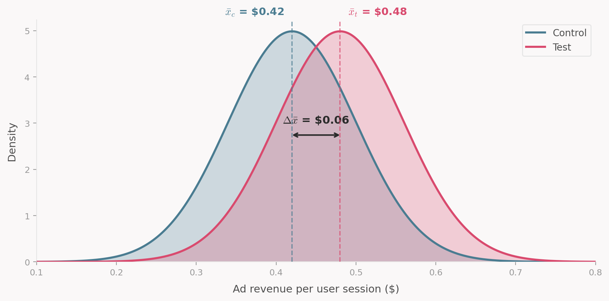
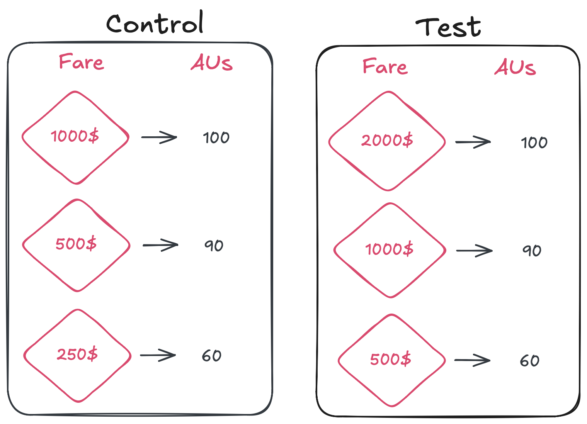

## The case for experimentation in the airline industry
Airlines are known to be low-margin businesses, yet they generate enormous revenues. Take Delta Air Lines as an example: in FY2025, its total operating revenue was around \$63 billion, with approximately \$52 billion coming from passenger ticket sales ([source](https://ir.delta.com/news/news-details/2026/Delta-Air-Lines-Announces-December-Quarter-and-Full-Year-2025-Financial-Results/default.aspx)).

This scale is what makes revenue management (RM) so valuable: very small improvements in pricing can translate into large financial gains. For Delta, a **1% improvement** in ticket pricing capabilities would add roughly **\$520 million** to their bottom line. As a result, pricing analysts, revenue managers, operations researchers, and countless other professionals spend a considerable amount of time trying to incrementally improve their systems, processes, and ways of working. These improvements are numerous and diversified, touching pricing, product, revenue management systems, overbooking levels, competitor response strategies, and more.

However, it's not always easy to know whether a change **actually resulted in a positive outcome**. Consider an airline that decides to raise fares during a fuel crisis. How should they measure whether the change was successful? They could compare against last year, but the market dynamics have changed. There probably wasn't the same fuel crisis last year, and the competitive landscape and customer expectations may have shifted as well.

They could track daily revenue and look at what changed before and after the fare increase, but this isn't ideal either. You can't simply compare transactions day over day without considering the **future value of remaining capacity**. You might sell a seat right now for \$10, but that doesn't mean you wouldn't have sold it closer to departure for \$300. More fundamentally, when comparing before and after, you always face the question: are market conditions now similar to what they were before the change? In a highly seasonal and dynamic business like the airline industry, this is rarely the case. When you're trying to measure very small incremental gains (less than 2%), these things matter a lot. It's just too easy to make the wrong call, and the cost of being slightly wrong is large. This is why proper experimentation is so valuable for airlines.

## Online experimentation is not so straightforward in revenue management

Airlines are not the first businesses to realize they could benefit greatly from experimentation. As a matter of fact, one of the most widely used statistical tests today is the t-test, which was invented in the early 1900s by William Sealy Gosset for quality control purposes at the Guinness brewery in Dublin ([source](https://www.scientificamerican.com/article/how-the-guinness-brewery-invented-the-most-important-statistical-method-in/)).

::: {.callout-tip collapse="false"}
## Fun fact: the origin of "Student's t-test"

Gosset published his work under the pseudonym "Student" because Guinness didn't want to tip off competitors to its research. This is why the technique is still known today as Student's t-test.
:::

In modern times, many of the developments in experimentation methodology have come from the tech industry. In a typical setting, a product manager at a platform like Microsoft Bing might want to know how ad revenue is affected by a change in their UI or search ranking. To measure this, they would pick a few metrics of interest (say, ad revenue per user session), then randomly expose some users to the new UI (the **test** group) and others to the old one (the **control** group). In the simplest case, they would run a t-test to compare the average ad revenue between the two groups and adopt the new UI if the result is positive and statistically significant.

{#fig-t-test}

I'm skipping over a lot of the technicalities here. There are sophisticated statistical models in place at these companies to run experiments faster, in parallel etc. The point I am trying to make is that these experiments are, at first glance, well behaved. It's **easy to randomly assign users to a test or control group. Users don't affect each other's outcomes. You can typically collect a large amount of data quickly**, which lets you make confident estimates.

### The shared inventory problem

Now contrast this with our pricing analyst who wants to see if raising fares will help the airline weather a fuel crisis. Unlike the online experiment, the analyst cannot simply show different prices to customers looking at the same itinerary through the same channel. This isn't a limitation of airline distribution systems. It's that **such a test wouldn't make sense**. In an RM world, the price that one customer sees is affected by the actions of every customer who came before them.

To see why, consider the two fare ladders below. The control group keeps the airline's current pricing while the test group doubles the fares at every level. Both structures share the same authorization units (AU), which represent the cumulative number of seats the airline is willing to sell at above or  each fare.

{#fig-fare-ladder}

Now imagine you want to compare these two structures on the same flight. As customers visit the booking site, you flip a coin: heads, they see the control fares; tails, the test fares. The problem is that both groups share the same seat inventory.

Say that after some time, 42 customers who saw the control fares and 18 who saw the test fares have purchased seats, filling all 60 seats available at the lowest price tier. The next fare up is now \$500 under the control structure and \$1,000 under the test structure. A new customer assigned to the test group sees \$1,000, but **that's not the price they would have seen if all prior customers had also been on the test fares**, because the inventory would have been consumed differently. Similarly, control customers near the end likely enjoyed lower prices than they would have if the airline had been running only the control fares all along, because some customers who saw the test fares and decide not to book would like have made a different choice had they seen the control fares.

In short, control and test customers affect each other through the shared inventory, hence this test is biased! This means that the randomization strategy needs to be done at a more aggregate level, for example by assigning entire flights to either the test or control group. This effectively reduces the sample size for airlines, which makes it harder to detect small differences in performance. It also means that the test and control groups are more likely to differ in their characteristics, which can bias results if not properly accounted for.

### The future value of remaining inventory

There is another critical difference from the online testing world stems from the capacity constraint. If you compare the revenue of two flights departing in July under the control and test fares, measuring revenue up through March doesn't tell you much about total revenue at departure. Cheaper fares tend to sell faster, which can mean more revenue early on but fewer seats left to sell closer to departure when fares are typically higher. To adequately compare the two pricing policies, you need to **either wait until the departure of the flight** to collect the observation or use a prediction to **estimate the future value of remaining inventory**. 

Both options introduce challenges: waiting until departure means that you can't iterate quickly on your experiments, while using predictions introduces model risk and uncertainty into your estimates.

::: {.callout-note}
This is far from an exhaustive list of challenges airlines face when running experiments on their RM platforms. But there's little value in listing every potential issue here. Instead, let's look at the principles supporting experimentation and discuss some common pitfalls and strategies adopted in revenue management.
:::

## The framework behind every test

Let's go back to our fare increase during the fuel crisis. You've decided to test whether raising fares by 20% improves revenue. You randomly assign 200 flights to keep current fares (**control**) and 200 flights to get the increase (**test**). After all flights depart, you compare average revenue per flight. Test is up 2.3%. Is this a success?

Not so fast. That 2.3% is only meaningful if that result is statistically significant and the test was set up correctly. "Correctly" here means satisfying a specific set of assumptions defined by the **Potential Outcomes Framework** [@hernan2020]. This framework underpins statistical tests and understanding it allows us to critically evaluate the validity of our results.

The core idea is very simple. To know whether the fare increase truly helped, you'd need to observe the same 200 flights under both the old and the new fares. Same passengers, same market conditions, same everything. The only difference: the price. Any gap in revenue would then be purely caused by the fare change.

Obviously, you can't run the same flight twice. Randomization is our best substitute: create two groups that are similar enough that comparing them approximates this impossible parallel-universe scenario. The quality of that approximation rests on a few assumptions. Let's walk through each one using our fare increase test.

### 1. No interference between units

A unit's outcome (e.g. revenue of a flight) must not depend on another unit treatment assignment [@hernan2020].

For instance, a light LGW-CDG on Monday is in the test group (higher fares). Flight LGW-CDG on Tuesday is in control (current fares). A price-sensitive customer shopping for either day sees the inflated Monday fare and books Tuesday instead. That Tuesday sale didn't happen because the control fares were compelling. It happened because the test fares on Monday pushed the customer over.

Now your control group looks better than it should, and your test group looks worse. The estimated treatment effect is biased downward. This is **interference**: the treatment on one unit changed the outcome on another. This is exactly the same issue we described in the shared inventory problem, but here instead of customers affecting each other through the remaining capacity, we have flights affecting each other through demand substitution.

::: {.callout-tip}
## How RM teams mitigate interference
Usually, to mitigate the risk of interference, RM teams separate test and control units in time and geography such that the likelihood of customers substituting between them is low. This is not a perfect solution, but it's a practical one. 
:::

### 2. No hidden treatment variations

Every unit assigned to a treatment must receive the **same version** of that treatment. This is usually less of a concern, but it matters when the treatment is contextual. Say you want to increase overbooking thresholds for flights with very high yield. A flight might qualify for that increase either 30 days or 10 days before departure. The "dosage" of the treatment differs because some flights have more time to absorb its effects. If we don't account for this variation, we end up averaging over different versions of the treatment, which is misleading and hard to interpret.

### 3. Exchangeability

The test and control groups must be **interchangeable**: if you swapped their assignments, the average outcomes would stay the same. In other words, treatment assignment is independent of potential outcomes.

Back to the fare increase. Imagine the randomization happened to put all summer peak flights in the test group and all off-peak flights in control. Peak flights would have earned more revenue regardless of the fare change. That 2.3% uplift you measured? Part of it (maybe all of it) is just seasonality, not pricing.

In practice, you check this **before** the test starts. Compare pre-treatment metrics between groups: load factor, yield, booking curves, share of business customers. If the groups don't look comparable, re-randomize.

### 4. Positivity

Every units in your experiment must have a non-zero chance of receiving each treatment. This constrains how far you can generalize. If you only tested the fare increase on short-haul European routes, you can't claim the result applies to transatlantic flights. Similarly, if the fare increase only activates when booked load factor is below 50%, you've only learned something about low-demand flights.

### 5. Consistency

The outcome you observe must genuinely result from the assigned treatment. If a test flight experienced both old and new fares during its booking window (say, because the treatment was switched on partway through), the observed revenue is not the true outcome we would have seen under a consistent treatment (test fares for the full booking window).

## Are you even measuring the right thing?

You can nail every assumption above and still draw the wrong conclusion if you are measuring the wrong thing. Your metric needs to actually represent the business outcome you care about hence it is important to put careful attention to your **Overall Evaluation Criterion (OEC)**.

Say that for our fare increase test, we decided to measure ticket revenue, how confident would you be a results showing a 2% uplift? You would probably be concerned that customers responded to higher fares by ditching ancillary purchases or maybe by downgrading from premium to economy. Some of these concerns can be directly addressed by measuring total revenue insead but some can't. For example, if the fare increase erodes customer loyalty, you won't see that in the revenue of the current flight. You would likely need to track customer lifetime value to capture that effect which may not be feasible on a short time horizon. 

Since the metric you choose shapes the decisions you make, it's worth asking yourself if **the metric capture the full effect I am trying to measure?** You don't want to simply track first order effect (e.g. ancillary revenue) if there are likely to be second order effects (e.g. ancillary revenue) that you can measure directly. If you can't measure the full effect directly, then we need to make it explicity that the metric is an imperfect proxy for the true outcome you care about.

::: {.callout-warning}
## When the "right" metric optimises the wrong outcome

Kohavi and Thomke describe an experiment at Bing where a bug degraded the relevance of search results. Revenue per search went **up** because users, unable to find what they needed in the organic results, clicked more on ads. If the team had used revenue per search as their OEC, they would have shipped a version of Bing that was objectively worse for users. The correct OEC needed to combine revenue with user satisfaction metrics like successful session rate to avoid shallow optimization [@kohavi2017].
:::

## Wrapping up

Experimentation in airlines is hard to do. We are often trying to measure a small signal on a noisy outcome, are limited by shared inventory to randomize at an aggregate level, and can very easily violate "silent" assumptions made by our statistical tests. The potential outcomes framework gives us the language to ask whether a test is actually valid before you launch it. Explicitely checking each assumption can help us avoid costly mistakes and make better decisions.

In an upcoming post, we will share a checklist that we use to design experiments in RM. It's not exhaustive, but it covers the most common failure modes. We will also discuss some of the strategies we use to mitigate these risks and how we think about trade-offs when designing experiments.
